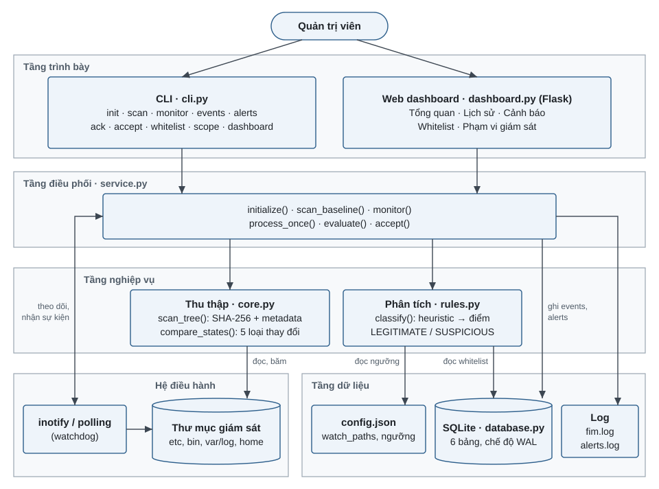
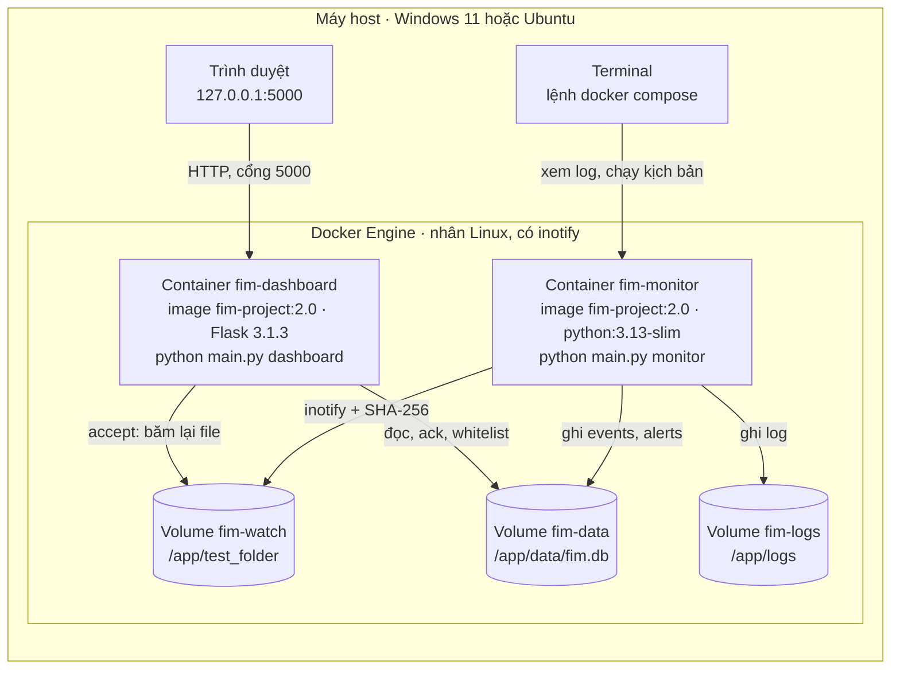
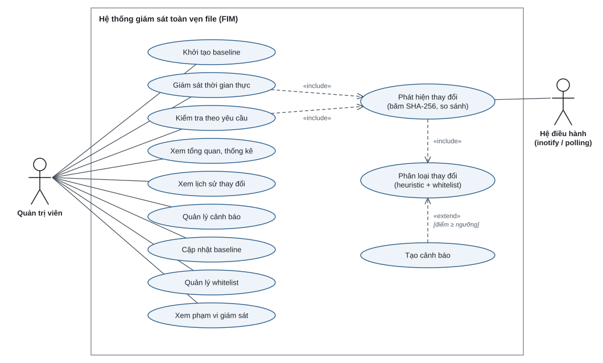
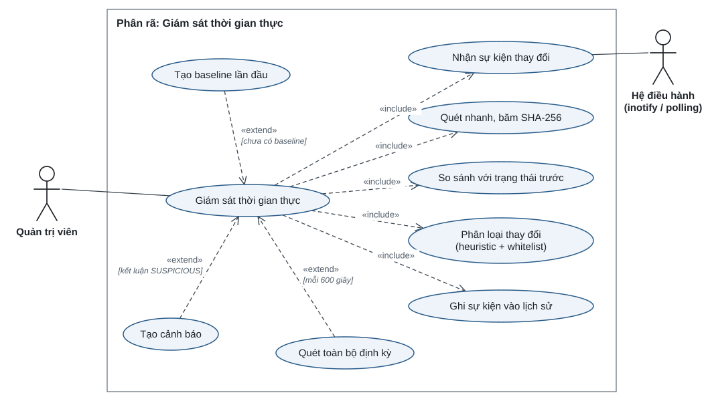
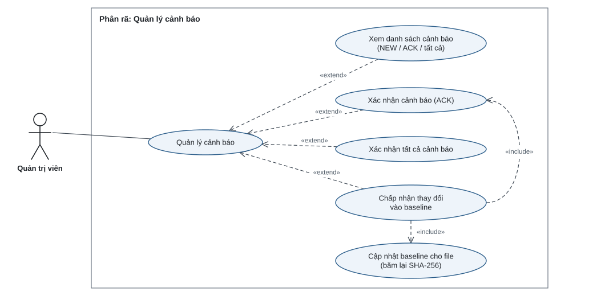
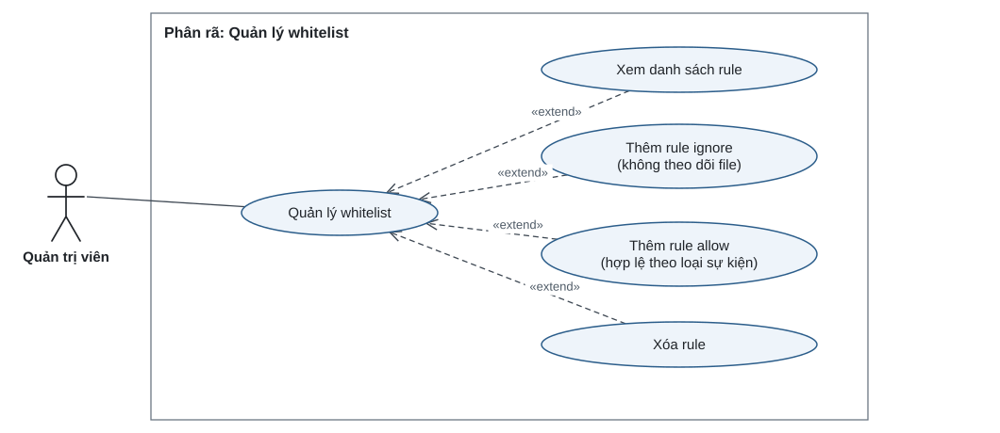
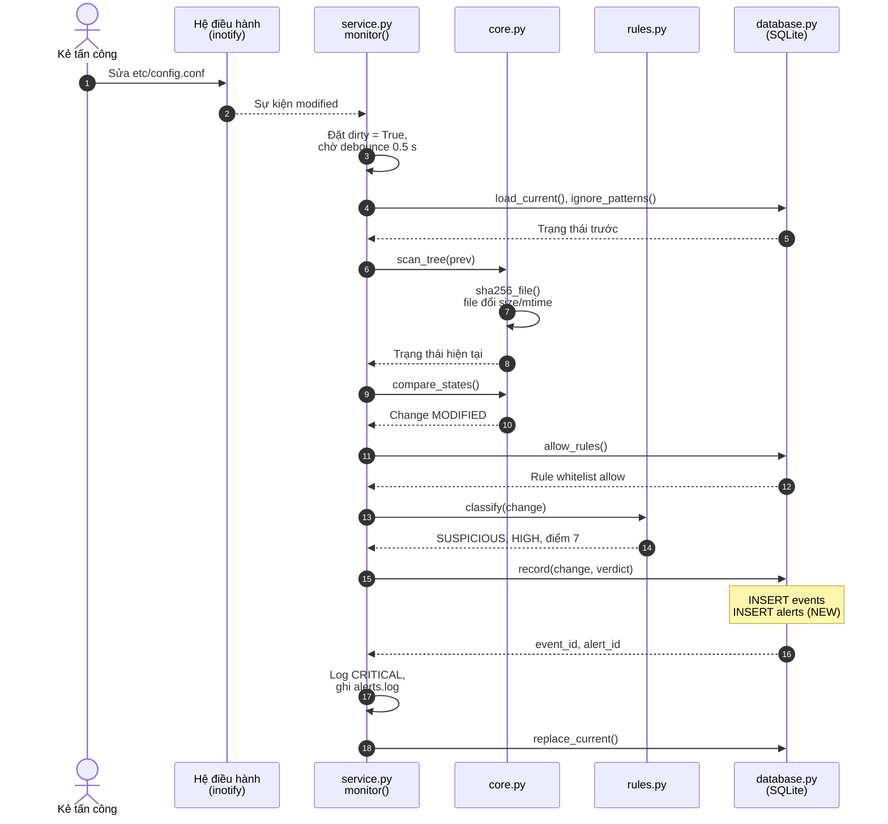
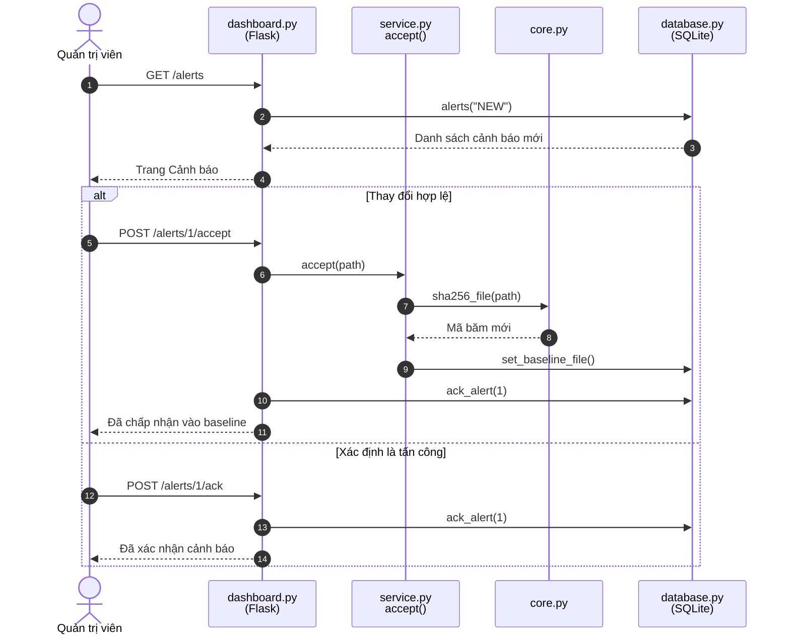
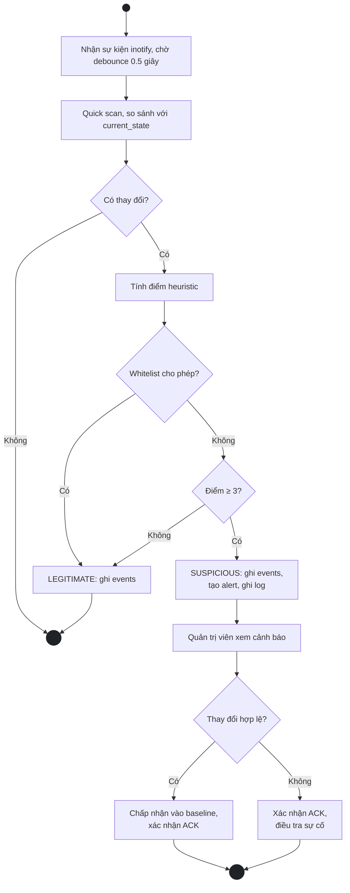
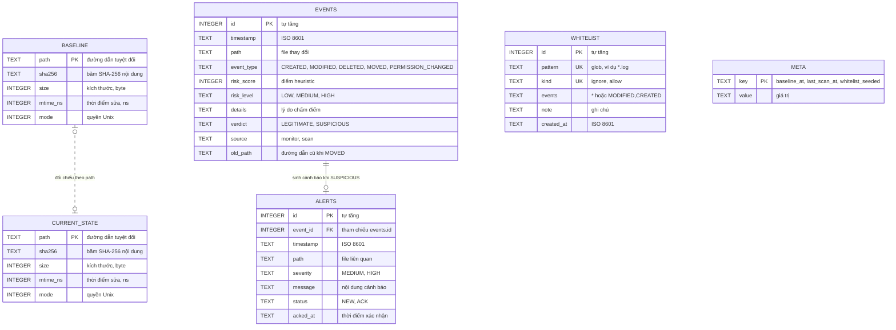

# Sơ đồ báo cáo FIM

Nguồn của các hình trong báo cáo. Hình 2, 7 đến 10 viết bằng Mermaid (xem được trên GitHub, mermaid.live hoặc VS Code có extension Mermaid). Hình 1 và Hình 3 đến 6 là file SVG trong `docs/diagrams/`, chèn thẳng vào Word bằng Insert → Pictures.

## Hình 1. Kiến trúc phân tầng

## Hình 2. Mô hình triển khai Docker

## Hình 3. Hệ thống giám sát toàn vẹn file (FIM)

## Hình 4. Phân rã: Giám sát thời gian thực

## Hình 5. Phân rã: Quản lý cảnh báo

## Hình 6. Phân rã: Quản lý whitelist

## Hình 7. Sơ đồ tuần tự: phát hiện thay đổi và tạo cảnh báo

## Hình 8. Sơ đồ tuần tự: quản trị viên xử lý cảnh báo

## Hình 9. Sơ đồ hoạt động luồng chính

## Hình 10. Sơ đồ cơ sở dữ liệu

